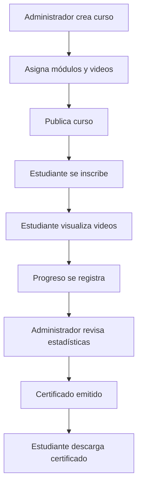

# 📘 Manual de Usuario y Flujo de Trabajo del Sistema

Este documento describe el **flujo de trabajo completo del sistema** dividido por roles: **Administrador** y **Estudiante**.  
Se detalla qué puede hacer cada tipo de usuario, cómo interactúan los módulos y el recorrido lógico del sistema.

---

## 🧩 1. Administrador

El **Administrador** tiene control total sobre la plataforma, pudiendo gestionar usuarios, cursos, módulos, videos, actividades, certificados y estadísticas.

### 📁 Estructura General del Módulo Administrador
```
actividades/
categorias/
certificados/
cursos/
cursos_estudiantes/
modulos/
usuarios/
videos/
videos-vistos/
components/
layout.tsx
page.tsx
```
Cada carpeta contiene archivos para **componentes**, **gestión**, **librerías de utilidades** y **estilos**.

---

### 👥 Usuarios

#### Funcionalidades Disponibles
- Crear nuevos usuarios (Administradores o Estudiantes)
- Editar información de usuario
- Eliminar usuarios del sistema
- Ver detalles individuales de cada usuario

#### Flujo de Trabajo
1. El administrador ingresa a **Usuarios → Gestión**.
2. Puede usar el formulario modal (`UserFormModal.tsx`) para **crear o editar** un usuario.
3. Los usuarios se listan en una tabla interactiva (`UserTable.tsx`).
4. Los datos se gestionan mediante `usuariosUtils.js` con peticiones a la API.

#### Relación con Otros Módulos
- Los usuarios se asocian a cursos mediante el módulo **Cursos-Estudiantes**.
- Los roles determinan qué vistas y permisos tienen en el sistema.

---

### 📚 Cursos

#### Funcionalidades Disponibles
- Crear, editar y eliminar cursos.
- Asignar módulos y videos a cada curso.
- Visualizar cursos activos e inactivos.

#### Flujo de Trabajo
1. Desde **Cursos → Gestión**, el administrador crea un curso con `CursoFormModal.tsx`.
2. Se guardan los datos mediante `cursosUtils.js`.
3. Los cursos se muestran en tarjetas (`CourseCard.tsx`) o tablas de gestión.
4. Cada curso se puede asociar a varios **Módulos** y **Videos**.

#### Relación con Otros Módulos
- Se enlaza con **Módulos** (contenidos del curso).
- Relación directa con **Cursos-Estudiantes** para inscripciones.

---

### 🧱 Módulos

#### Funcionalidades Disponibles
- Crear, editar y eliminar módulos de aprendizaje.
- Asociar módulos a un curso específico.

#### Flujo de Trabajo
1. Desde **Módulos → Gestión**, el administrador crea o modifica un módulo (`ModuloFormModal.tsx`).
2. Los datos se gestionan en `modulosUtils.js`.
3. Los módulos se listan con detalles en `ModuloCard.tsx`.

#### Relación con Otros Módulos
- Cada módulo pertenece a un curso.
- Los videos están vinculados a módulos específicos.

---

### 🎬 Videos

#### Funcionalidades Disponibles
- Subir, editar o eliminar videos.
- Asignar videos a módulos.
- Consultar estadísticas de visualización.

#### Flujo de Trabajo
1. Desde **Videos → Gestión**, el administrador carga un video.
2. La información se guarda con `videosUtils.js`.
3. Los videos se muestran en tablas con opciones de filtro.

#### Relación con Otros Módulos
- Conectados a **Módulos** y **Cursos**.
- Los estudiantes registran visualizaciones en **Videos Vistos**.

---

### 🧑‍🎓 Cursos-Estudiantes

#### Funcionalidades Disponibles
- Asignar o eliminar estudiantes en cursos.
- Consultar el progreso o estado de inscripción.

#### Flujo de Trabajo
1. Desde **Cursos-Estudiantes**, el administrador abre el panel de inscripciones.
2. Usa `InscripcionFormModal.tsx` para añadir o retirar usuarios.
3. Visualiza todas las inscripciones en `InscripcionesTable.tsx`.

#### Relación con Otros Módulos
- Conecta **Usuarios** con **Cursos**.
- Permite controlar el avance académico.

---

### 🧾 Certificados

#### Funcionalidades Disponibles
- Crear, emitir o editar certificados.
- Asociar certificados a cursos o estudiantes.
- Ver reportes de emisión.

#### Flujo de Trabajo
1. Desde **Certificados → Gestión**, se accede al formulario (`CertificadoFormModal.tsx`).
2. Los certificados se guardan y listan mediante `CertificadoTable.tsx`.
3. Uso de `certificadosUtils.ts` para las operaciones CRUD.

#### Relación con Otros Módulos
- Vinculado a cursos completados y estudiantes que han cumplido requisitos.

---

### 📊 Actividades y Estadísticas

#### Funcionalidades Disponibles
- Visualizar estadísticas de progreso.
- Consultar actividades completadas o pendientes.
- Generar reportes internos.

#### Flujo de Trabajo
1. Desde **Actividades**, se listan los registros (`ActividadTable.tsx`).
2. El sistema obtiene datos desde `actividadesUtils.ts` o `.js`.
3. Se pueden aplicar filtros y exportar datos.

#### Relación con Otros Módulos
- Actividades conectadas con **Videos**, **Cursos** y **Estudiantes**.

---

### 🔐 Autenticación y Permisos

- Solo los usuarios con rol de **Administrador** pueden acceder al módulo administrador.
- Cada vista valida el token o sesión activa antes de cargar datos.
- Permite cerrar sesión o redirigir al login si no hay sesión válida.

---

## 🎓 2. Estudiante

El **Estudiante** puede acceder a su panel personal, explorar cursos, ver videos, seguir su progreso y descargar certificados.

### 📁 Estructura General del Módulo Estudiante
```
certificados/
cursos/
dashboard/
perfil/
videos/
components/
layout.tsx
page.tsx
```
Incluye pantallas personalizadas y componentes dinámicos para cada sección.

---

### 🔐 Autenticación y Perfil

#### Funcionalidades Disponibles
- Registro e inicio de sesión.
- Edición del perfil personal (`EditProfile.tsx`).
- Visualización de progreso y logros.

#### Flujo de Trabajo
1. El estudiante inicia sesión.
2. Accede al **Dashboard principal** (`dashboard/page.tsx`).
3. Desde el menú lateral (`IntegratedStudentSidebar.tsx`), puede navegar por cursos, perfil y certificados.

---

### 📚 Cursos

#### Funcionalidades Disponibles
- Ver todos los cursos disponibles.
- Acceder al detalle del curso (`CourseDetailClient.tsx`).
- Inscribirse en un curso.
- Ver módulos y videos asociados.

#### Flujo de Trabajo
1. En la página de **Cursos**, el estudiante ve los cursos activos.
2. Al seleccionar uno, se muestra su detalle con información del contenido.
3. Desde ahí puede reproducir videos o marcar módulos como completados.

#### Relación con Otros Módulos
- Se conecta con **Videos**, **Certificados** y **Progreso del Estudiante**.

---

### 🎬 Videos

#### Funcionalidades Disponibles
- Reproducir videos del curso.
- Registrar progreso y completado.
- Volver a ver videos anteriores.

#### Flujo de Trabajo
1. Desde el detalle del curso, accede a un video.
2. El sistema registra el tiempo visto y estado de completado.
3. Se guardan estadísticas en el módulo **Videos-Vistos** (administrador).

---

### 🧾 Certificados

#### Funcionalidades Disponibles
- Ver certificados obtenidos.
- Descargar certificados (`CertificateDownload.tsx`).
- Consultar cursos completados.

#### Flujo de Trabajo
1. Una vez finalizado un curso, se genera un certificado.
2. El estudiante puede descargarlo desde su **Dashboard** o sección **Certificados**.

---

### 🧭 Dashboard Principal

#### Funcionalidades Disponibles
- Ver resumen de actividades recientes.
- Consultar nuevos cursos, videos o logros.
- Navegación entre secciones (`NewCoursesSection.tsx`, `NewCertificatesSection.tsx`, `NewProfileSection.tsx`).

#### Flujo de Trabajo
1. Al iniciar sesión, se muestra el panel principal con widgets.
2. Los componentes visualizan información dinámica del progreso y cursos activos.

---

### 🔔 Otras Funcionalidades

- **Notificaciones** internas (nuevos cursos o certificados).
- **Historial de progreso** y logros personales.
- **Formulario de interés** (`PurchaseInterestForm.tsx`) para enviar solicitudes o comentarios.

---

## 🔄 Conexión entre Módulos (Administrador ↔ Estudiante)

| Módulo             | Administrador                          | Estudiante                          |
|--------------------|----------------------------------------|-------------------------------------|
| Usuarios           | Crea y gestiona cuentas                | Accede a su perfil                  |
| Cursos             | Crea, edita y elimina                  | Se inscribe y los visualiza         |
| Módulos            | Define contenido de los cursos         | Aprende a través de ellos           |
| Videos             | Sube y organiza                        | Reproduce y registra progreso       |
| Certificados       | Genera y emite                         | Descarga y consulta                 |
| Actividades        | Supervisa desempeño                    | Realiza y completa tareas           |
| Cursos-Estudiantes | Administra inscripciones               | Se matricula en cursos              |

---

## ⚙️ Lógica General del Flujo de Trabajo



---

## 🧠 Conclusión

El sistema integra un entorno completo para **gestión académica digital**, permitiendo al **Administrador** controlar todo el contenido y a los **Estudiantes** formarse de manera estructurada, con seguimiento de su progreso, certificados automáticos y paneles personalizados.
